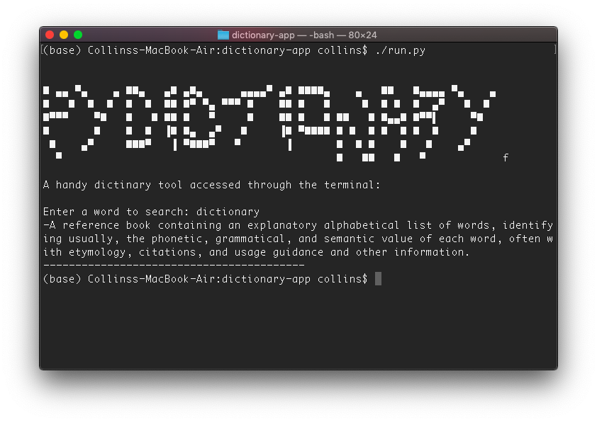

# py-dictionary
A simple interactive English dictionary made using python 3.7.4.

## features
Search for words and get their definition.
The dictionary provides smart word recommendations in case of any typo.

## author
Collins Muriuki

## requirements
* You are required to have python3.* installed
* The following external modules are required to be installed as well (latest versions)
    * json: to install run `pip3 install json` in your terminal
    * difflib: to install run `pip3 install difflib` in your terminal

## instructions and requirements
* Clone the project using the following command: `git clone https://github.com/collinsmuriuki/tictactoe.git` or download the zip file
* Open your terminal and navigate to the directory  `/tictactoe` 
* Run the following command to make the app executable on the terminal `chmod +x run.py` 
* To start the dictionary app, run the command `./run.py`

## bugs
* Issue finding titled cased words such as names of coutries or cities e.g Paris
* The app does not return definitions for acronyms such as USA and NATO

## license

[MIT License](LICENSE)